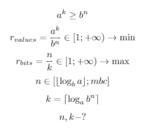
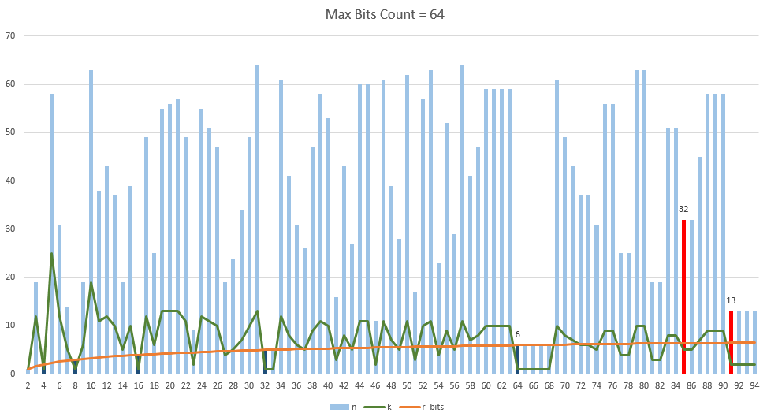

BaseNcoding
===========

There are well-known algorithms for binary data to string encoding exist, such as algorithms with alphabet length with radix of power 2 (base32, base64) and algorithms with alphabet length with radix not of power 2 ([base85](http://en.wikipedia.org/wiki/Ascii85) and  [base91](http://sourceforge.net/projects/base91/)).

This library contains an implementation of algorithm for general case, that is a custom-length alphabet can be used. Here is [**online BaseNcoding DEMO**](http://kvanttt.github.io/BaseNcoding/).

Idea of developed algorithm based on base85 encoding, except of block size is not constant, but it's calculation depends on an alphabet length.

## Steps of algorithm

1. Calculation of block size in bits and chars.
2. Conversation of input string to byte array (using UTF8 Encoding).
3. Splitting byte array on n-bit groups.
4. Conversation of every group to radix n.
5. Tail bits processing.

## Mathematical justification 

For optimal block size calculation the following considerations has been used:



In this system:

* **a** — Length of alphabet **A**.
* **k** — Count of encoding chars.
* **b** — Digit radix (2 in most cases).
* **n** — Number of bits in radix **b** for representing **k** chars of alphabet **A**.
* **r_values** — Compression ratio (less is better).
* **r_bits** — Bits per char count (greater is better).
* **mbc** — Block max bits count.
* **⌊x⌋** — The largest integer not greater than x (floor).
* **⌈x⌉** — The smallest integer not less than x (ceiling).

See implementation in `GetOptimalBitsCount` method.

## Tail bits processing

The most difficult problem in this project which nevertheless has been solved with only integer calculations.

### Calculation of total and tail number of bits and chars during encoding

```CSharp
int mainBitsLength = (data.Length * 8 / BlockBitsCount) * BlockBitsCount;
int tailBitsLength = data.Length * 8 - mainBitsLength;
int totalBitsLength = mainBitsLength + tailBitsLength;
int mainCharsCount = mainBitsLength * BlockCharsCount / BlockBitsCount;
int tailCharsCount = (tailBitsLength * BlockCharsCount + BlockBitsCount - 1) / BlockBitsCount;
int totalCharsCount = mainCharsCount + tailCharsCount;
int iterationCount = mainCharsCount / BlockCharsCount;
```

### Calculation of total and tail number of bits and chars during decoding

```CSharp
int totalBitsLength = ((data.Length - 1) * BlockBitsCount / BlockCharsCount + 8) / 8 * 8;
int mainBitsLength = totalBitsLength / BlockBitsCount * BlockBitsCount;
int tailBitsLength = totalBitsLength - mainBitsLength;
int mainCharsCount = mainBitsLength * BlockCharsCount / BlockBitsCount;
int tailCharsCount = (tailBitsLength * BlockCharsCount + BlockBitsCount - 1) / BlockBitsCount;
BigInteger tailBits = CharsToBits(data, mainCharsCount, tailCharsCount);
if (tailBits >> tailBitsLength != 0)
{
	totalBitsLength += 8;
	mainBitsLength = totalBitsLength / BlockBitsCount * BlockBitsCount;
	tailBitsLength = totalBitsLength - mainBitsLength;
	mainCharsCount = mainBitsLength * BlockCharsCount / BlockBitsCount;
	tailCharsCount = (tailBitsLength * BlockCharsCount + BlockBitsCount - 1) / BlockBitsCount;
}
int iterationCount = mainCharsCount / BlockCharsCount;
```

## Experiment

Diagram of an optimal block size and alphabet length dependence has been calculated with help of system above for **mbc = 64**:


<details>
    <summary>Diagram values</summary>

| a | n | k | r\_bits | r\_values |
| - | - | - | - | - |
| 2 | 1 | 1 | 1 | 1 |
| 3 | 19 | 12 | 1.5833 | 1.0136 |
| 4 | 2 | 1 | 2 | 1 |
| 5 | 58 | 25 | 2.32 | 1.034 |
| 6 | 31 | 12 | 2.5833 | 1.0136 |
| 7 | 14 | 5 | 2.8 | 1.0258 |
| 8 | 3 | 1 | 3 | 1 |
| 9 | 19 | 6 | 3.1667 | 1.0136 |
| 10 | 63 | 19 | 3.3158 | 1.0842 |
| 11 | 38 | 11 | 3.4545 | 1.038 |
| 12 | 43 | 12 | 3.5833 | 1.0136 |
| 13 | 37 | 10 | 3.7 | 1.0031 |
| 14 | 19 | 5 | 3.8 | 1.0258 |
| 15 | 39 | 10 | 3.9 | 1.0489 |
| 16 | 4 | 1 | 4 | 1 |
| 17 | 49 | 12 | 4.0833 | 1.0349 |
| 18 | 25 | 6 | 4.1667 | 1.0136 |
| 19 | 55 | 13 | 4.2308 | 1.1672 |
| 20 | 56 | 13 | 4.3077 | 1.1369 |
| 21 | 57 | 13 | 4.3846 | 1.0719 |
| 22 | 49 | 11 | 4.4545 | 1.038 |
| 23 | 9 | 2 | 4.5 | 1.0332 |
| 24 | 55 | 12 | 4.5833 | 1.0136 |
| 25 | 51 | 11 | 4.6364 | 1.0588 |
| 26 | 47 | 10 | 4.7 | 1.0031 |
| 27 | 19 | 4 | 4.75 | 1.0136 |
| 28 | 24 | 5 | 4.8 | 1.0258 |
| 29 | 34 | 7 | 4.8571 | 1.0041 |
| 30 | 49 | 10 | 4.9 | 1.0489 |
| 31 | 64 | 13 | 4.9231 | 1.3237 |
| 32 | 5 | 1 | 5 | 1 |
| 33 | 5 | 1 | 5 | 1.0313 |
| 34 | 61 | 12 | 5.0833 | 1.0349 |
| 35 | 41 | 8 | 5.125 | 1.024 |
| 36 | 31 | 6 | 5.1667 | 1.0136 |
| 37 | 26 | 5 | 5.2 | 1.0333 |
| 38 | 47 | 9 | 5.2222 | 1.1739 |
| 39 | 58 | 11 | 5.2727 | 1.1015 |
| 40 | 53 | 10 | 5.3 | 1.1642 |
| 41 | 16 | 3 | 5.3333 | 1.0517 |
| 42 | 43 | 8 | 5.375 | 1.1008 |
| 43 | 27 | 5 | 5.4 | 1.0953 |
| 44 | 60 | 11 | 5.4545 | 1.038 |
| 45 | 60 | 11 | 5.4545 | 1.329 |
| 46 | 11 | 2 | 5.5 | 1.0332 |
| 47 | 61 | 11 | 5.5455 | 1.0721 |
| 48 | 39 | 7 | 5.5714 | 1.0679 |
| 49 | 28 | 5 | 5.6 | 1.0523 |
| 50 | 62 | 11 | 5.6364 | 1.0588 |
| 51 | 17 | 3 | 5.6667 | 1.012 |
| 52 | 57 | 10 | 5.7 | 1.0031 |
| 53 | 63 | 11 | 5.7273 | 1.005 |
| 54 | 23 | 4 | 5.75 | 1.0136 |
| 55 | 52 | 9 | 5.7778 | 1.0226 |
| 56 | 29 | 5 | 5.8 | 1.0258 |
| 57 | 64 | 11 | 5.8182 | 1.1187 |
| 58 | 41 | 7 | 5.8571 | 1.0041 |
| 59 | 47 | 8 | 5.875 | 1.0433 |
| 60 | 59 | 10 | 5.9 | 1.0489 |
| 61 | 59 | 10 | 5.9 | 1.2375 |
| 62 | 59 | 10 | 5.9 | 1.456 |
| 63 | 59 | 10 | 5.9 | 1.7086 |
| 64 | 6 | 1 | 6 | 1 |
| 65 | 6 | 1 | 6 | 1.0156 |
| 66 | 6 | 1 | 6 | 1.0313 |
| 67 | 6 | 1 | 6 | 1.0469 |
| 68 | 6 | 1 | 6 | 1.0625 |
| 69 | 61 | 10 | 6.1 | 1.0609 |
| 70 | 49 | 8 | 6.125 | 1.024 |
| 71 | 43 | 7 | 6.1429 | 1.034 |
| 72 | 37 | 6 | 6.1667 | 1.0136 |
| 73 | 37 | 6 | 6.1667 | 1.1011 |
| 74 | 31 | 5 | 6.2 | 1.0333 |
| 75 | 56 | 9 | 6.2222 | 1.042 |
| 76 | 56 | 9 | 6.2222 | 1.1739 |
| 77 | 25 | 4 | 6.25 | 1.0476 |
| 78 | 25 | 4 | 6.25 | 1.1031 |
| 79 | 63 | 10 | 6.3 | 1.0266 |
| 80 | 63 | 10 | 6.3 | 1.1642 |
| 81 | 19 | 3 | 6.3333 | 1.0136 |
| 82 | 19 | 3 | 6.3333 | 1.0517 |
| 83 | 51 | 8 | 6.375 | 1.0002 |
| 84 | 51 | 8 | 6.375 | 1.1008 |
| 85 | 32 | 5 | 6.4 | 1.0331 |
| 86 | 32 | 5 | 6.4 | 1.0953 |
| 87 | 45 | 7 | 6.4286 | 1.0722 |
| 88 | 58 | 9 | 6.4444 | 1.098 |
| 89 | 58 | 9 | 6.4444 | 1.2155 |
| 90 | 58 | 9 | 6.4444 | 1.3441 |
| 91 | 13 | 2 | 6.5 | 1.0109 |
| 92 | 13 | 2 | 6.5 | 1.0332 |
| 93 | 13 | 2 | 6.5 | 1.0558 |
| 94 | 13 | 2 | 6.5 | 1.0786 |

</details>

One can see that known base64, base85, base91 encodings has been developed in good points (minimal block size with good compression ratio).

Big numbers ([C# BitInteger](https://msdn.microsoft.com/en-us/library/system.numerics.biginteger(v=vs.110).aspx) and [JavaScript jsbn](https://github.com/andyperlitch/jsbn) used for some calculations.

Algorithm also has a parallel version.

## License

BaseN algorithm is licensed under the Apache 2.0 License.

More detail explanation available [on Russian](http://habrahabr.ru/post/219993/).
